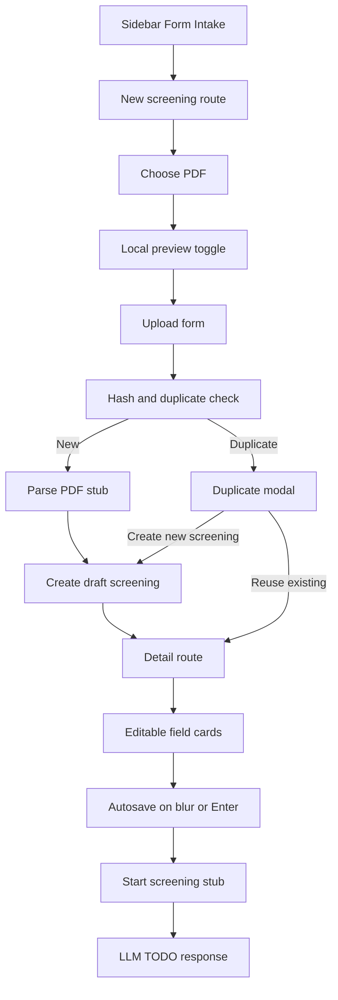

# PDF Intake + Screening Flow Annotated Patch Plan

## Purpose
This document is the implementation handoff for the PDF intake and screening workflow requested for the `monday-changes` branch. It is written as a single annotated patch plan so Code mode can implement it file by file without re-deciding the architecture.

## Branch
Create the implementation branch before changing code:

```bash
git checkout -b monday-changes
```

## Confirmed product behavior
- Add a new top sidebar item for form intake.
- Use a dedicated intake route at `/screenings/new`.
- Use a stable detail route at `/screenings/:id`.
- Upload a PDF, preview it in the frontend before submission, then upload it to the backend.
- Backend runs a PDF extraction stub behind a `pdfplumber`-shaped service boundary.
- New documents create a draft screening immediately after extraction succeeds.
- Duplicate documents show a modal with `Reuse existing`, `Create new screening`, and `Cancel`.
- `Reuse existing` opens the existing saved screening detail route.
- `Create new screening` clones the extracted payload into a new draft linked to the same document fingerprint.
- The PDF stays persisted on the backend and remains previewable on both routes.
- `Screen Name` is required before `Start Screening`.
- `Website` is optional.
- All other extracted fields are editable and auto-save on blur or Enter.
- `Start Screening` is a stub for now and returns the saved JSON payload plus an LLM TODO response.

## Why this design fits the current repository
- The frontend already has a clean route shell in `frontend/src/App.tsx` and a left navigation in `frontend/src/components/layout/Sidebar.tsx`.
- The frontend already has an upload/progress pattern in `frontend/src/pages/BuildIndexPage.tsx`.
- The backend already uses service + router + repository layering in `backend/app/main.py`, `backend/app/core/dependencies.py`, and `backend/app/storage/lists_repo.py`.
- SQLite is already an accepted local persistence choice in the repo, so it is the fastest compatible option for first release.
- The current theme tokens already support the requested shadcn-style card UI without adding a new design system.

## Patch manifest

### Update existing files
- `backend/requirements.txt`
- `backend/pyproject.toml`
- `backend/app/core/config.py`
- `backend/app/core/dependencies.py`
- `backend/app/main.py`
- `frontend/src/App.tsx`
- `frontend/src/components/layout/Sidebar.tsx`
- `frontend/src/api/client.ts`
- `frontend/src/api/endpoints.ts`
- `frontend/src/api/types.ts`

### Add new files
- `backend/app/schemas/screenings.py`
- `backend/app/storage/screenings_repo.py`
- `backend/app/services/screenings.py`
- `backend/app/routers/screenings.py`
- `backend/tests/test_screenings.py`
- `frontend/src/pages/ScreeningIntakePage.tsx`
- `frontend/src/pages/ScreeningDetailPage.tsx`
- `frontend/src/components/screenings/UploadPdfCard.tsx`
- `frontend/src/components/screenings/ScreeningDuplicateDialog.tsx`
- `frontend/src/components/screenings/ScreeningPdfPreview.tsx`
- `frontend/src/components/screenings/EditableFieldCard.tsx`
- `frontend/src/components/screenings/ScreeningFieldGrid.tsx`

## Data contract decisions

### 1. Normalize extracted field keys
The attached JSON example uses human-readable keys with spaces and punctuation. Those are fine for display but awkward for code, patch requests, and JSON merge logic. Keep two shapes:

- `raw_extraction_payload_json` for the raw parser output
- `normalized extracted_fields_json` and `edited_fields_json` for app logic

Recommended normalized map:

| Raw key | Normalized key | UI label |
| --- | --- | --- |
| Type | `type` | Type |
| Name | `name` | Name |
| HQ | `hq` | HQ |
| Sponsor name | `sponsor_name` | Sponsor name |
| Sponsor Relationship | `sponsor_relationship` | Sponsor Relationship |
| Screening Request Name | `screening_request_name` | Screening Request Name |
| Submitter Name | `submitter_name` | Submitter Name |
| Submitter SID | `submitter_sid` | Submitter SID |
| Senior Client Exec(s) | `senior_client_execs` | Senior Client Exec(s) |
| Target Sector | `target_sector` | Target Sector |
| Target Revenue | `target_revenue` | Target Revenue |
| Target EBITDA | `target_ebitda` | Target EBITDA |
| Investment Criteria | `investment_criteria` | Investment Criteria |
| Geographical Focus | `geographical_focus` | Geographical Focus |

Implementation rule: always fill every normalized key, defaulting to an empty string, so the frontend never has to branch on missing keys.

### 2. Keep document storage separate from screening drafts
Use one stored PDF per file hash and allow many screenings to point to the same document. This is the cleanest way to support duplicate reuse and duplicate cloning without duplicating binary files.

### 3. Keep extracted and edited values separate
- `extracted_fields_json` is the normalized output immediately after parsing.
- `edited_fields_json` is the mutable working copy shown in the UI.

This prevents losing the original parser output and makes future audit or compare views easy.

## SQLite schema proposal

```sql
CREATE TABLE IF NOT EXISTS screening_documents (
    id TEXT PRIMARY KEY,
    pdf_sha256 TEXT NOT NULL UNIQUE,
    original_filename TEXT NOT NULL,
    storage_path TEXT NOT NULL,
    file_size_bytes INTEGER NOT NULL,
    mime_type TEXT,
    extraction_status TEXT NOT NULL,
    raw_extraction_payload_json TEXT NOT NULL,
    extraction_version TEXT NOT NULL,
    created_at TEXT NOT NULL,
    updated_at TEXT NOT NULL
);

CREATE TABLE IF NOT EXISTS screenings (
    id TEXT PRIMARY KEY,
    document_id TEXT NOT NULL,
    status TEXT NOT NULL,
    screen_name TEXT,
    website TEXT,
    inbound_date TEXT,
    target_date TEXT,
    targets_found INTEGER,
    output_file TEXT,
    extracted_fields_json TEXT NOT NULL,
    edited_fields_json TEXT NOT NULL,
    llm_request_json TEXT,
    llm_response_json TEXT,
    created_at TEXT NOT NULL,
    updated_at TEXT NOT NULL,
    FOREIGN KEY (document_id) REFERENCES screening_documents(id) ON DELETE CASCADE
);

CREATE INDEX IF NOT EXISTS ix_screenings_document_id ON screenings(document_id);
CREATE INDEX IF NOT EXISTS ix_screenings_updated_at ON screenings(updated_at);
```

Notes:
- Keep `screen_name` nullable at creation time because drafts are created before the user fills it.
- Do not make `screen_name` unique in v1.
- Keep future-oriented fields like `inbound_date`, `target_date`, `targets_found`, and `output_file` nullable now, even if the first UI does not edit them.

## Backend annotated patch

### 1. Update `backend/requirements.txt`

```diff
+ pdfplumber>=0.11.0
```

Reasoning:
- The parser is still a stub, but the dependency should exist now so the service boundary matches the future real integration.

### 2. Update `backend/pyproject.toml`

```diff
 [project]
 dependencies = [
   ...
+  "pdfplumber>=0.11.0",
 ]
```

Reasoning:
- Keep the declared package dependencies aligned with `backend/requirements.txt`.

### 3. Update `backend/app/core/config.py`
Add new default path helpers and settings fields:

```diff
+ def _default_screenings_dir() -> str:
+     return str(_default_repo_root() / "screenings")
+
+ def _default_screenings_db_path() -> str:
+     return str(_default_repo_root() / "screenings" / "screenings.db")
+
+ def _default_screening_documents_dir() -> str:
+     return str(_default_repo_root() / "screenings" / "documents")
...
+     screenings_dir: str = Field(default_factory=_default_screenings_dir)
+     screenings_db_path: str = Field(default_factory=_default_screenings_db_path)
+     screening_documents_dir: str = Field(default_factory=_default_screening_documents_dir)
```

Reasoning:
- This mirrors the existing pattern used for lists, history, index jobs, and index bundles.
- It keeps all screening data in one top-level local state folder.

### 4. Add `backend/app/schemas/screenings.py`
Add Pydantic models for:

- `ScreeningSummary`
- `ScreeningDocumentSummary`
- `ScreeningDetail`
- `ScreeningIntakeDuplicateItem`
- `ScreeningIntakeResponse`
- `ScreeningDuplicateCreateRequest`
- `ScreeningFieldPatchRequest`
- `ScreeningFieldPatchResponse`
- `ScreeningStartResponse`

Recommended shape details:

```python
class ScreeningDetail(BaseModel):
    id: str
    document_id: str
    status: str
    screen_name: str | None = None
    website: str | None = None
    inbound_date: str | None = None
    target_date: str | None = None
    targets_found: int | None = None
    output_file: str | None = None
    extracted_fields: dict[str, str]
    edited_fields: dict[str, str]
    original_filename: str
    pdf_sha256: str
    created_at: str
    updated_at: str
```

```python
class ScreeningIntakeResponse(BaseModel):
    status: Literal["created", "duplicate"]
    document_id: str
    screening: ScreeningDetail | None = None
    existing_screenings: list[ScreeningIntakeDuplicateItem] = []
    default_reuse_screening_id: str | None = None
```

```python
class ScreeningFieldPatchRequest(BaseModel):
    screen_name: str | None = None
    website: str | None = None
    edited_fields: dict[str, str | None] = Field(default_factory=dict)
```

Reasoning:
- Keep the patch request small and autosave-friendly.
- Return enough data for the detail route without making the client reconstruct joins.

### 5. Add `backend/app/storage/screenings_repo.py`
Use the same repository style already present in the lists repository.

Responsibilities:
- create tables
- connect with `sqlite3.connect(..., check_same_thread=False)`
- insert and fetch document rows
- insert screening drafts
- clone screening draft from existing document
- update top-level screening fields
- merge `edited_fields_json`
- fetch all screenings for a document
- fetch one screening with joined document metadata
- mark screening as started and persist stub request and response payloads

Recommended method list:

```python
class ScreeningsRepository:
    def get_document_by_hash(self, pdf_sha256: str) -> dict[str, Any] | None: ...
    def create_document(self, payload: dict[str, Any]) -> dict[str, Any]: ...
    def list_screenings_for_document(self, document_id: str) -> list[dict[str, Any]]: ...
    def create_screening(self, payload: dict[str, Any]) -> dict[str, Any]: ...
    def clone_screening_from_document(self, document_id: str, extracted_fields: dict[str, str]) -> dict[str, Any]: ...
    def get_screening(self, screening_id: str) -> dict[str, Any] | None: ...
    def patch_screening(self, screening_id: str, patch: dict[str, Any]) -> dict[str, Any] | None: ...
    def mark_started(self, screening_id: str, llm_request: dict[str, Any], llm_response: dict[str, Any]) -> dict[str, Any] | None: ...
```

Repository rules:
- Store JSON columns as serialized text.
- On patch, merge `edited_fields_json` into the current JSON instead of replacing the whole payload unless full replacement is explicitly requested.
- Always update `updated_at`.
- `clone_screening_from_document` should reuse the document row and create a fresh screening row with `status='draft'`.

### 6. Add `backend/app/services/screenings.py`
This service owns all business logic.

Recommended public methods:

```python
class ScreeningsService:
    def intake_pdf_upload(self, upload: UploadFile) -> ScreeningIntakeResponse: ...
    def create_duplicate_screening(self, document_id: str) -> ScreeningDetail: ...
    def get_screening(self, screening_id: str) -> ScreeningDetail: ...
    def patch_screening(self, screening_id: str, payload: ScreeningFieldPatchRequest) -> ScreeningFieldPatchResponse: ...
    def get_pdf_path(self, screening_id: str) -> Path: ...
    def start_screening(self, screening_id: str) -> ScreeningStartResponse: ...
```

#### Upload flow logic
1. Validate uploaded filename suffix is `.pdf`.
2. Stream the upload to a temporary file while computing SHA-256.
3. Check repository for an existing `screening_documents` row with that hash.
4. If a matching document exists:
   - delete the temporary uploaded file
   - fetch existing screenings linked to the document
   - return `status='duplicate'`
   - set `default_reuse_screening_id` to the most recently updated linked screening
5. If no matching document exists:
   - move the temp file to `screenings/documents/<sha256>.pdf`
   - call the extraction adapter
   - store raw extraction payload on the document row
   - normalize it into the internal field map
   - create a draft screening with both `extracted_fields_json` and `edited_fields_json` seeded from the normalized payload
   - return `status='created'` with the screening detail

#### Extraction adapter rule
Even though this is a stub, structure it like the real dependency boundary:

```python
def _extract_with_pdfplumber_stub(self, pdf_path: Path) -> dict[str, Any]:
    # Later this becomes the real parser.
    # For now it returns the expected raw JSON shape.
```

Important: the rest of the service should not know that extraction is currently stubbed. That makes the later real parser drop-in.

#### Duplicate-create flow
1. Fetch the document by id.
2. Load the stored raw extraction JSON or normalized payload.
3. Normalize again if needed.
4. Create a new screening draft linked to the same document.
5. Return the new screening detail.

#### Patch flow
1. Validate the screening exists.
2. Normalize blank strings for `screen_name` and `website` but do not force `screen_name` during draft autosave.
3. Merge incoming `edited_fields` into current `edited_fields_json`.
4. Save and return a small autosave response.

#### Start-screening flow
1. Load screening.
2. Reject with `ValidationAppError` if `screen_name` is blank.
3. Save a stub request payload containing the draft snapshot.
4. Save a stub response payload:

```json
{
  "message": "LLM step is TODO. Returning saved draft payload.",
  "payload": {"...": "..."}
}
```

5. Update screening status to `screening_started`.
6. Return the stub response.

### 7. Add `backend/app/routers/screenings.py`
Add a new router with prefix `/screenings` and tag `screenings`.

Endpoints:
- `POST /screenings/intake`
- `POST /screenings/intake/duplicate-create`
- `GET /screenings/{screening_id}`
- `PATCH /screenings/{screening_id}/fields`
- `GET /screenings/{screening_id}/pdf`
- `POST /screenings/{screening_id}/start`

Recommended endpoint shapes:

```python
@router.post("/intake", response_model=ScreeningIntakeResponse)
def intake_screening_pdf(...):
    ...

@router.post("/intake/duplicate-create", response_model=ScreeningDetail)
def create_duplicate_screening(...):
    ...

@router.patch("/{screening_id}/fields", response_model=ScreeningFieldPatchResponse)
def patch_screening_fields(...):
    ...

@router.get("/{screening_id}/pdf")
def get_screening_pdf(...):
    return FileResponse(..., media_type="application/pdf")
```

### 8. Update `backend/app/core/dependencies.py`
Add a `get_screenings_service` dependency that follows the same app-state caching pattern as the existing services.

```diff
+ from app.services.screenings import ScreeningsService
...
+ def get_screenings_service(request: Request) -> ScreeningsService:
+     service = getattr(request.app.state, "screenings_service", None)
+     if isinstance(service, ScreeningsService):
+         return service
+     settings = get_request_settings(request)
+     service = ScreeningsService(settings)
+     request.app.state.screenings_service = service
+     return service
```

### 9. Update `backend/app/main.py`
Add:
- a `screenings` tag in `tags_metadata`
- `app.state.screenings_service = ScreeningsService(settings)`
- router include for the new screenings router

```diff
+ from app.routers.screenings import router as screenings_router
+ from app.services.screenings import ScreeningsService
...
+ app.state.screenings_service = ScreeningsService(settings)
...
+ app.include_router(screenings_router, prefix=settings.api_v1_prefix)
```

### 10. Add `backend/tests/test_screenings.py`
Test matrix:
- upload a new PDF creates one document and one draft screening
- upload the same PDF again returns `status='duplicate'`
- duplicate-create returns a new screening id and reuses the same document id
- `PATCH /fields` updates `screen_name`
- `PATCH /fields` updates an extracted field such as `target_sector`
- `GET /pdf` streams the stored PDF
- `POST /start` fails when `screen_name` is empty
- `POST /start` succeeds when `screen_name` is present and returns stub LLM payload

Test strategy:
- monkeypatch the extraction adapter so tests do not depend on real PDF parsing
- use temporary screening storage paths just like the repo already uses temp dirs for other tests
- assert both database persistence and response payload shape

## Frontend annotated patch

### 11. Update `frontend/src/api/client.ts`
There is a current mismatch between backend app errors and frontend toast parsing.

Current frontend assumption:
- looks for `response.data.detail`

Current backend app-error shape:
- sends `response.data.error.message`

Patch the interceptor so it reads both.

```diff
+ const payload = error.response?.data;
+ const detail = payload?.detail;
+ const appMessage = payload?.error?.message;
+ const message = typeof detail === 'string'
+   ? detail
+   : typeof appMessage === 'string'
+     ? appMessage
+     : error.message || 'An unexpected error occurred';
```

Reasoning:
- Without this, screening-specific validation errors may show generic failure messages.

### 12. Update `frontend/src/api/types.ts`
Add interfaces for:
- `ScreeningDetail`
- `ScreeningDuplicateItem`
- `ScreeningIntakeResponse`
- `ScreeningFieldPatchRequest`
- `ScreeningFieldPatchResponse`
- `ScreeningStartResponse`

Recommended detail shape:

```ts
export interface ScreeningDetail {
  id: string;
  document_id: string;
  status: 'draft' | 'screening_started';
  screen_name: string | null;
  website: string | null;
  inbound_date: string | null;
  target_date: string | null;
  targets_found: number | null;
  output_file: string | null;
  extracted_fields: Record<string, string>;
  edited_fields: Record<string, string>;
  original_filename: string;
  pdf_sha256: string;
  created_at: string;
  updated_at: string;
}
```

### 13. Update `frontend/src/api/endpoints.ts`
Add new functions:

```ts
export async function uploadScreeningIntake(
  file: File,
  onUploadProgress?: (pct: number) => void,
): Promise<ScreeningIntakeResponse>

export async function createDuplicateScreening(documentId: string): Promise<ScreeningDetail>

export async function getScreeningDetail(screeningId: string): Promise<ScreeningDetail>

export async function patchScreeningFields(
  screeningId: string,
  payload: ScreeningFieldPatchRequest,
): Promise<ScreeningFieldPatchResponse>

export function getScreeningPdfUrl(screeningId: string): string

export async function startScreening(screeningId: string): Promise<ScreeningStartResponse>
```

Implementation notes:
- Reuse the same multipart upload pattern already used for index job uploads.
- `getScreeningPdfUrl` should derive from the same `VITE_API_BASE` logic as the other endpoint helpers.

### 14. Update `frontend/src/App.tsx`
Add two routes:

```diff
+ import { ScreeningIntakePage } from './pages/ScreeningIntakePage';
+ import { ScreeningDetailPage } from './pages/ScreeningDetailPage';
...
+ <Route path="/screenings/new" element={<ScreeningIntakePage />} />
+ <Route path="/screenings/:id" element={<ScreeningDetailPage />} />
```

### 15. Update `frontend/src/components/layout/Sidebar.tsx`
Add a new top navigation item above `Search`.

Recommended label:
- `Form Intake`

Recommended icon:
- `FileText` or `ClipboardPen` from `lucide-react`

Recommended order:
1. Form Intake
2. Search
3. Lists
4. Build Index

Reasoning:
- The user explicitly wants it at the top of the left drawer and distinct from search.

### 16. Add `frontend/src/pages/ScreeningIntakePage.tsx`
Responsibilities:
- choose local PDF file
- drag-drop PDF
- create local object URL for pre-upload preview
- toggle preview open and closed
- upload to backend with progress bar
- show duplicate modal when needed
- navigate to `/screenings/:id` after successful creation or duplicate-create

Local state:
- `file`
- `isDragging`
- `isSubmitting`
- `uploadPct`
- `previewOpen`
- `previewUrl`
- `duplicateState`

Behavior details:
- Validate `.pdf` extension before upload.
- Use `URL.createObjectURL(file)` for pre-upload preview.
- Revoke object URLs in cleanup.
- If upload returns `status='created'`, navigate immediately to the detail route.
- If upload returns `status='duplicate'`, open the duplicate dialog.

Suggested page structure:
- page header
- upload card
- preview toggle section
- duplicate dialog mounted at page level

### 17. Add `frontend/src/pages/ScreeningDetailPage.tsx`
Responsibilities:
- fetch screening detail by route param
- render top header inputs for `Screen Name` and `Website`
- render toggleable backend PDF preview
- render editable field cards for extracted data
- auto-save per field on blur or Enter
- call `startScreening`

State model:
- use React Query for initial fetch
- keep a local editable draft map for immediate UI response
- keep a `savingByField` map keyed by field name
- keep `previewOpen`

Important detail:
- do not introduce a global Zustand store for this feature in v1
- this workflow is route-local and fits React Query plus local component state better

Top-of-page UX:
- `Screen Name` input should be visually prominent and required
- `Website` input sits beside or below it and is optional
- save these through the same patch endpoint used by card autosave

Start-screening behavior:
- disable button while mutation is pending
- if `screen_name` is blank locally, show a warning before issuing the request
- after success, toast the stub message and optionally keep the user on the page

### 18. Add `frontend/src/components/screenings/UploadPdfCard.tsx`
This should reuse the visual behavior already proven in the index build page:
- hidden file input
- click-to-browse area
- drag-drop styling
- uploaded file pill row
- remove file button
- upload progress bar

Differences from the index build card:
- accept `.pdf`
- no bundle-name input
- include a `Preview` toggle button before upload
- primary button label is `Upload form`

### 19. Add `frontend/src/components/screenings/ScreeningDuplicateDialog.tsx`
Responsibilities:
- show duplicate warning
- list existing screenings linked to the same document
- default the selected screening to the most recently updated item
- provide actions:
  - `Reuse existing`
  - `Create new screening`
  - `Cancel`

Suggested data shown in the modal:
- original filename
- short hash
- existing screening name if present
- status
- updated time

If multiple linked screenings exist, the dialog should let the user choose which existing screening to open when they click `Reuse existing`.

### 20. Add `frontend/src/components/screenings/ScreeningPdfPreview.tsx`
Responsibilities:
- show an inline toggleable preview container
- support either a local object URL or backend streaming URL
- use `iframe`, `embed`, or `object` for PDF display
- expose a compact open-close toggle header

Important implementation detail:
- the preview should not be a modal
- the user needs to compare the PDF with editable fields while working

### 21. Add `frontend/src/components/screenings/EditableFieldCard.tsx`
Responsibilities:
- display one extracted field
- show label and current value
- copy-to-clipboard button
- enter edit mode on double click
- show saving state for that field
- save on blur or Enter for single-line fields

Important multiline rule:
- `investment_criteria` should be treated as multiline
- for multiline cards, save on blur or `Ctrl+Enter` instead of raw Enter so the user can still type line breaks

Recommended props:

```ts
interface EditableFieldCardProps {
  fieldKey: string;
  label: string;
  value: string;
  multiline?: boolean;
  required?: boolean;
  isSaving?: boolean;
  onSave: (nextValue: string) => Promise<void>;
}
```

Copy behavior:
- use `navigator.clipboard.writeText`
- toast on success
- no-op with a muted state if the value is empty

### 22. Add `frontend/src/components/screenings/ScreeningFieldGrid.tsx`
This component should:
- own the field config array
- map normalized keys to labels
- decide which fields are multiline
- render a responsive grid of `EditableFieldCard`

Recommended field config:

```ts
const SCREENING_FIELD_CONFIG = [
  { key: 'type', label: 'Type' },
  { key: 'name', label: 'Name' },
  { key: 'hq', label: 'HQ' },
  { key: 'sponsor_name', label: 'Sponsor name' },
  { key: 'sponsor_relationship', label: 'Sponsor Relationship' },
  { key: 'screening_request_name', label: 'Screening Request Name' },
  { key: 'submitter_name', label: 'Submitter Name' },
  { key: 'submitter_sid', label: 'Submitter SID' },
  { key: 'senior_client_execs', label: 'Senior Client Exec(s)' },
  { key: 'target_sector', label: 'Target Sector' },
  { key: 'target_revenue', label: 'Target Revenue' },
  { key: 'target_ebitda', label: 'Target EBITDA' },
  { key: 'investment_criteria', label: 'Investment Criteria', multiline: true },
  { key: 'geographical_focus', label: 'Geographical Focus' },
];
```

## API payload examples

### `POST /api/v1/screenings/intake` new document response

```json
{
  "status": "created",
  "document_id": "doc_123",
  "screening": {
    "id": "scr_123",
    "document_id": "doc_123",
    "status": "draft",
    "screen_name": null,
    "website": null,
    "inbound_date": null,
    "target_date": null,
    "targets_found": null,
    "output_file": null,
    "extracted_fields": {
      "type": "...",
      "name": "..."
    },
    "edited_fields": {
      "type": "...",
      "name": "..."
    },
    "original_filename": "screening.pdf",
    "pdf_sha256": "...",
    "created_at": "...",
    "updated_at": "..."
  },
  "existing_screenings": [],
  "default_reuse_screening_id": null
}
```

### `POST /api/v1/screenings/intake` duplicate response

```json
{
  "status": "duplicate",
  "document_id": "doc_123",
  "screening": null,
  "existing_screenings": [
    {
      "id": "scr_existing",
      "screen_name": "Alpha Screen",
      "status": "draft",
      "updated_at": "..."
    }
  ],
  "default_reuse_screening_id": "scr_existing"
}
```

### `PATCH /api/v1/screenings/:id/fields` request

```json
{
  "screen_name": "Healthcare Platform Targets",
  "edited_fields": {
    "target_sector": "Healthcare IT"
  }
}
```

### `POST /api/v1/screenings/:id/start` response

```json
{
  "screening_id": "scr_123",
  "status": "screening_started",
  "message": "LLM step is TODO. Returning saved draft payload.",
  "payload": {
    "screen_name": "Healthcare Platform Targets",
    "website": "example.com",
    "edited_fields": {
      "target_sector": "Healthcare IT"
    }
  }
}
```

## Interaction sequences

### New upload sequence
1. User opens `/screenings/new`.
2. User chooses a PDF.
3. Frontend optionally previews via local object URL.
4. User clicks `Upload form`.
5. Backend hashes the file and sees no duplicate.
6. Backend stores the PDF, runs extraction stub, creates draft screening.
7. Frontend navigates to `/screenings/:id`.
8. User edits fields and each field autosaves.
9. User clicks `Start Screening` and gets stub LLM response.

### Duplicate upload sequence
1. User uploads a PDF already seen before.
2. Backend matches the SHA-256.
3. Frontend opens duplicate dialog.
4. `Reuse existing` navigates to the selected screening detail route.
5. `Create new screening` calls duplicate-create, gets a fresh draft id, and navigates there.
6. `Cancel` stays on `/screenings/new` with the chosen file still visible until the user removes it.

## Mermaid flow



## Reasoning and gotchas

### 1. Fix the frontend error parser first
The screening feature will depend heavily on validation errors and duplicate messaging. If `frontend/src/api/client.ts` still only reads `detail`, the new backend errors from `backend/app/core/errors.py` will be harder to understand in the UI.

### 2. Do not create a second stored PDF for duplicates
The whole point of the document table is to keep one physical PDF per hash and many screenings per document.

### 3. Keep route state local
Do not add a new Zustand store unless implementation proves it necessary. The current app already has global stores for reusable cross-page state. This workflow is mostly request-bound and is better handled with route state plus React Query.

### 4. Keep the parser boundary clean
Do not spread PDF parsing logic into the router or repository. Keep it in the screening service so the later real parser only replaces one adapter.

### 5. Keep multiline behavior intentional
`Investment Criteria` likely needs multiline editing. Use blur or `Ctrl+Enter` save there instead of plain Enter.

### 6. Hide future DB fields in the first UI
Keep `inbound_date`, `target_date`, `targets_found`, and `output_file` in the database now, but do not expose them in the first screen unless they become part of the requested UX.

### 7. Screen Name validation belongs in two places
- frontend: quick warning before start
- backend: final enforcement before changing status

## Acceptance checklist
- Sidebar has a top `Form Intake` entry.
- `/screenings/new` supports PDF selection, removal, preview toggle, upload, and progress.
- Backend creates a draft screening immediately for new documents.
- Duplicate PDF upload shows the required modal.
- Reuse existing opens an existing detail route.
- Create new screening creates a new draft linked to the same document.
- `/screenings/:id` shows persistent PDF preview and editable field cards.
- `Screen Name` autosaves and is required before start.
- `Website` autosaves and remains optional.
- Extracted fields autosave per card.
- Copy buttons work.
- Start screening returns the stub payload and TODO message.
- Backend tests cover new upload, duplicate detection, clone, autosave patch, PDF streaming, and start validation.

## Recommended implementation order
1. Create branch `monday-changes`.
2. Add backend dependency and config path changes.
3. Add backend schemas and repository.
4. Add backend screening service and router.
5. Register dependency and router in the app.
6. Add backend tests with monkeypatched extraction.
7. Add frontend API types and endpoint helpers.
8. Add sidebar route entries.
9. Build the intake page and upload card.
10. Build the duplicate dialog.
11. Build the detail page, preview panel, and field grid.
12. Add autosave behavior and start-screening stub integration.
13. Run backend tests and manually smoke test the frontend flow.

## Final handoff note
This document is intentionally detailed enough to act as the implementation script for Code mode. It should be used as the source of truth when the actual code changes begin on the `monday-changes` branch.
